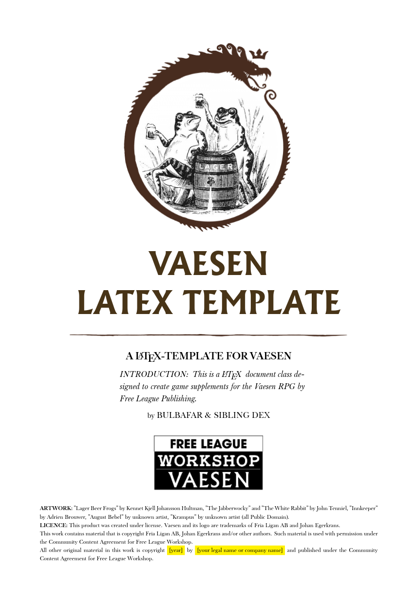

# Vaesen LaTeX Template

## About this Project
This is a LaTeX document class designed to create game supplements for the Vaesen RPG by Free League under the Community Content Agreement for Free League Workshop. 

## Getting Started
Clone this repository to use a local LaTeX installation or use an online environment like www.overleaf.com to create your own Vaesen hoebrew.

### Use Lua(La)TeX or Xe(La)TeX
The document class must be compiled using LuaTeX or XeTeX for some of the packages, like `fontspec`, to work.

## Contact
This template was made by Bulbafar and Sibling Dex. You can find us on the [Vaesen RPG Discord](https://discord.com/channels/1108036058844778516/1420680047408447551) server. Message us there if you are interested in helping with this project.

